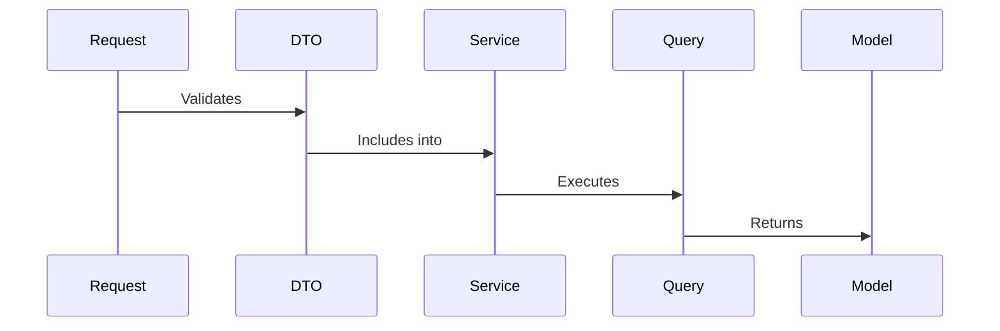

# Restaurant reservations

# Introduction notes
Within this application not all of the controllers are based on architectural solution that is described below, because it is a small MVP application.
Having in mind about future development of this project, all of the controllers should have implementation of the following architectural model. This would keep all of the project files more readable, scaleable and easily maintanable. While creating this application, decision to keep simpler logic not decomposed, were only made considering the time factor. This is a not good practice of mixing more than one architectural model. All of the logic should be layered, decomposed and consistent.

# Setup
## Project

Project is created with laravel built-in dockerized enviroment ***sail***
`./vendor/bin/sail up`

## Postman

Provided importable ***postman*** collection
`/misc/restaurant-reservations.postman_collection.json`

# Data management architecture

# Implemented practices

- [x] **Single Responsibility** pattern
- [x] **Dependency Inversion** pattern
- [x] **Data Transfer Object** pattern
- [ ] **Repository** pattern (lack of knowledge in Eloquent ORM practices)

# Not implemented features (TODOs)
- [x] 404 Handling middleware
- [ ] Seeds
- [ ] Better exception handling w/ response handling
...